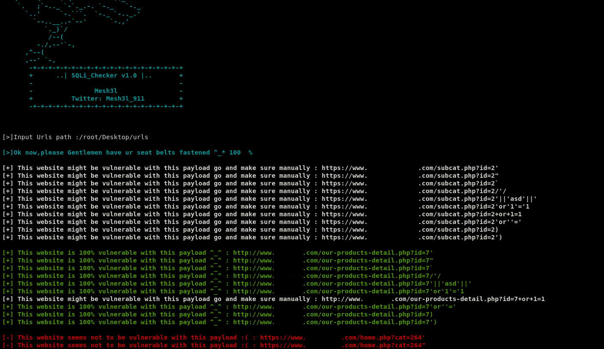

# ...| يالله حيهم |...

# SQLi_Checker :
It's a tool to automate the process of testing websites against SQLi.

# Installation :
git clone https://github.com/Mesh3l911/SQLi_Checker.git

# Usage :
1-cllect urls that u want to test and save 'em all in a text file For example: www.website.com/index.php?id=4234  
2-Fire up the script ( python SQLi_Checker.py ) 
3-Right the urls path 
4-Enjoy ^_* 

# Version :
This is only the beta version v1.0

